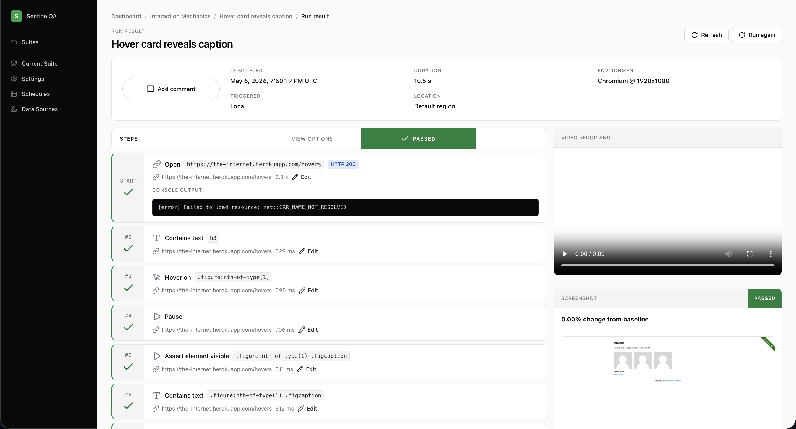

# SentinelQA

No-code browser test automation and monitoring for modern web applications.

SentinelQA lets teams record user flows, turn them into maintainable browser tests, run them on a schedule or from CI, and review failures with step timelines, screenshots, videos, traces, console output, visual comparisons, and accessibility reports.

## Features

- **Codeless test creation**: browser recorder, no-code editor, reusable steps, variables, secrets, and data-driven runs.
- **Real browser execution**: Playwright-powered runners with configurable browser, viewport, headers, geolocation, timezone, and locale.
- **Actionable results**: pass/fail step timeline, per-step diagnostics, screenshots, video recordings, traces, console logs, and comments.
- **Visual testing**: screenshot baselines, diff artifacts, tolerance thresholds, and baseline approval workflow.
- **Accessibility testing**: axe-powered checks with report artifacts.
- **Monitoring**: suite runs, schedules, webhooks, notification endpoints, and CLI/API-triggered executions.

## Documentation

- [Local development](docs/local-development.md)
- [API reference](docs/api.md)
